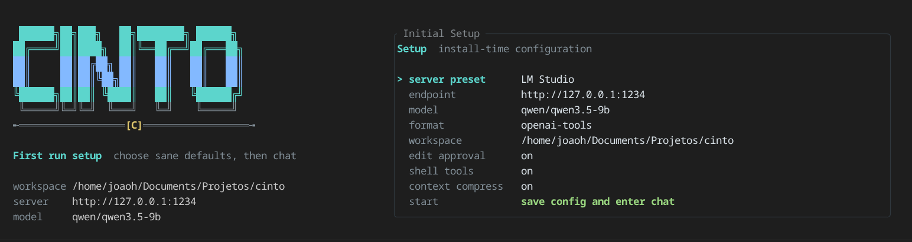

# Cinto

[English](README.md) · [Notas de arquitetura](docs/architecture.md)



**Cinto é um harness local em terminal para agentes de código rodando contra
servidores compatíveis com OpenAI.** Ele dá a modelos locais e open-weight um
loop de workspace observável: ler arquivos, pesquisar código, propor edições,
manter tarefas, inspecionar prompts e operar dentro de controles explícitos.

## Por Que Cinto

A maioria dos agentes esconde o harness. O Cinto deixa a engrenagem visível.

- **Local-first:** funciona com LM Studio, Ollama e outros servidores
  compatíveis com OpenAI.
- **Dois modos de tools:** Harmony para modelos `gpt-oss` e `tool_calls`
  nativo para Qwen, Llama e modelos similares.
- **Setup em TUI:** greeter inicial, presets de servidor/modelo, settings, chat
  e sugestões de paths.
- **Ferramentas de workspace:** `list_files`, `read_file`, `search`,
  `write_file` e `delete_file`.
- **Controles de segurança:** aprovação de edições, `/diff`, `/checkpoint`,
  proteção de `.git`/`.cinto` e sem shell execution no milestone atual.
- **Contexto persistente:** suporte opcional a `AGENTS.md` na raiz do projeto.
- **Gestão de contexto:** resultados grandes e histórico antigo são compactados
  antes de estourar a janela do modelo.

## Instalação

### Pelo código-fonte

Funciona hoje a partir do repositório público:

```sh
cargo install --git https://github.com/Jshebb/cinto
```

### Instalador shell (Linux / macOS)

Depois da primeira tag `v*`, o workflow de release publica os binários
pré-compilados:

```sh
curl -fsSL https://raw.githubusercontent.com/Jshebb/cinto/main/install.sh | sh
```

O instalador detecta a plataforma, baixa `cinto-<target>.tar.gz` do GitHub
Releases, verifica o checksum SHA-256, instala o binário em
`${XDG_BIN_HOME:-$HOME/.local/bin}` e adiciona automaticamente ao seu profile.

Para escolher outro destino:

```sh
curl -fsSL https://raw.githubusercontent.com/Jshebb/cinto/main/install.sh \
  | CINTO_INSTALL_DIR="$HOME/bin" sh
```

### Instalador PowerShell (Windows)

```powershell
Invoke-WebRequest -Uri https://raw.githubusercontent.com/Jshebb/cinto/main/install.ps1 -UseBasicParsing | Invoke-Expression
```

Ele baixa e extrai a última release para `~\.local\bin` e adiciona o diretório
automaticamente no seu `PATH` de usuário.

### npm

Depois da publicação dos pacotes npm:

```sh
npm install -g @cinto/cli
npx @cinto/cli
```

O pacote `cinto` é um launcher pequeno que depende do pacote opcional da sua
plataforma, como `@cinto/linux-x64` ou `@cinto/darwin-arm64`.

### Desinstalar

```sh
cinto uninstall
cinto uninstall --purge-config
```

`--purge-config` também remove `~/.config/cinto`.

## Começando

1. Inicie um servidor local compatível com OpenAI.
2. Rode:

```sh
cinto
```

3. No setup TUI, escolha um preset, confirme endpoint/modelo/workspace e salve.
4. Teste com um pedido focado:

```text
Resuma este repositório e liste os arquivos que você inspecionou.
```

Comandos úteis:

```sh
cinto setup          # reabre o setup inicial
cinto --skip-setup   # entra direto no chat
cinto --print-prompt # mostra o prompt vazio renderizado
cinto --config ./config.toml
```

## Setup de Modelo

Endpoint padrão do LM Studio:

```text
http://127.0.0.1:1234
```

O Cinto normaliza URLs base para `/v1/chat/completions`. Também dá para passar
um endpoint explícito `/v1/completions` quando o servidor usa completion de
texto.

| Servidor | Endpoint | Formato recomendado | Observação |
| --- | --- | --- | --- |
| LM Studio com `gpt-oss` | `http://127.0.0.1:1234` | `harmony` | Use o model id mostrado pelo LM Studio. |
| LM Studio com Qwen/Llama | `http://127.0.0.1:1234` | `openai-tools` | Use `thinking_effort = "none"`. |
| Ollama | `http://127.0.0.1:11434` | `openai-tools` | Use um modelo com tools, como `qwen2.5-coder:7b-instruct`. |

Exemplo com Ollama:

```sh
ollama pull qwen2.5-coder:7b-instruct
cinto setup
```

Config equivalente:

```toml
[model]
endpoint = "http://127.0.0.1:11434"
model = "qwen2.5-coder:7b-instruct"
format = "openai-tools"
thinking_effort = "none"
```

## Fluxo no TUI

Dentro do TUI:

- Use `/tools` para ver o catálogo de tools exposto ao modelo.
- Use `/prompt` para ver exatamente o que está sendo enviado.
- Use `/settings`, `Tab` ou `F2` para editar modelo e harness.
- Use `/diff` antes e depois de trabalho arriscado.
- Use `/checkpoint [label]` para salvar um patch em `.cinto/checkpoints`.
- Use `/git`, `/stage`, `/unstage` e `/commit` para ações git explícitas.

Atalhos:

| Tecla | Ação |
| --- | --- |
| `Tab` / `F2` | Alterna Chat e Settings |
| `Enter` | Envia mensagem ou edita/aplica setting |
| `Right` | Aceita a primeira sugestão de path |
| `Up` / `Down` | Navega settings |
| `Space` | Alterna booleanos |
| `s` | Salva config TOML |
| `Ctrl-C` | Sai |

## AGENTS.md

O Cinto lê `AGENTS.md` na raiz do workspace e injeta o conteúdo nas instruções
de developer do modelo. Use para:

- contexto do projeto
- convenções de código
- comandos comuns
- anti-padrões a evitar
- expectativas de teste/release

O arquivo é opcional e limitado para não dominar o prompt. Use `/prompt` para
inspecionar o conteúdo final.

Para repositórios não confiáveis:

```toml
[harness]
load_workspace_instructions = false
```

Ou desligue `workspace instructions` em Settings.

## Segurança

Cinto é um harness local de agente, não uma sandbox.

- Tools de leitura podem enviar conteúdo do workspace ao endpoint configurado.
- Edições e deleções exigem aprovação no TUI por padrão.
- Paths não podem escapar da raiz do workspace.
- Internos `.git` e `.cinto` são protegidos dos tools do modelo.
- Shell execution não está exposto no milestone atual.
- Arquivos de release são verificados com SHA-256, mas ainda não há code
  signing/notarização.

Evite apontar o Cinto para repositórios com `.env`, chaves privadas ou
credenciais de produção, a menos que você confie no servidor de modelo e entenda
o que o agente pode ler.

## Configuração

Config padrão: `~/.config/cinto/config.toml`. Também dá para usar `--config`.

```toml
[model]
endpoint = "http://127.0.0.1:1234"
model = "openai/gpt-oss-20b"
format = "harmony"            # harmony ou openai-tools
api_key_env = ""
max_tokens = 4096
temperature = 0.2
thinking_effort = "medium"    # none, low, medium, high
stream = true
stop = ["<|return|>", "<|call|>"]
request_timeout_secs = 600
context_window = 8192

[harness]
workspace = "/home/you/project"
allow_shell = false
require_edit_approval = true
max_tool_turns = 16
auto_context_compression = true
context_compression_threshold = 80
context_compression_keep_recent = 18
load_workspace_instructions = true
system_prompt = "You are Cinto, a local coding agent running in a terminal UI."
developer_prompt = "Use concise reasoning, ask before destructive actions, and prefer small verifiable edits."
```

Quando `api_key_env` é definido, o Cinto lê o segredo dessa variável de ambiente
e envia como bearer token. O TUI salva só o nome da variável, não o segredo.

## Formatos Suportados

| Formato | Shape de tool-calling | Melhor uso |
| --- | --- | --- |
| `harmony` | Tool calls embutidos no texto Harmony | `gpt-oss-20b`, `gpt-oss-120b` e servidores compatíveis com Harmony |
| `openai-tools` | Campos `tools` e `tool_calls` compatíveis com OpenAI | Qwen, Llama, Ollama, LM Studio e servidores chat compatíveis |

Se o modelo fica chamando tools sem responder, aumente `max_tool_turns` ou peça
uma tarefa menor. Se o modelo não retorna texto nem tool call, o Cinto mostra um
evento `Empty Model Response` com o modelo e formato ativos.

## Desenvolvimento

```sh
cargo fmt --check
cargo clippy --all-targets --all-features -- -D warnings
cargo test
cargo run -- setup
cargo run
```

Checks de release/package:

```sh
cargo package --allow-dirty --no-verify
sh -n install.sh
node --check npm-package/bin/cinto.js
npm pack --dry-run ./npm-package
```

## Status

Cinto está em estágio inicial. O foco atual é o loop local de agente,
adaptadores de prompt/tool, setup inicial, instalação e controles de segurança.
Shell tools, adapters específicos, persistência mais rica e binários assinados
podem vir depois.

## Licença

Licenciado sob [MIT](LICENSE-MIT) ou [Apache-2.0](LICENSE-APACHE) à sua escolha.
